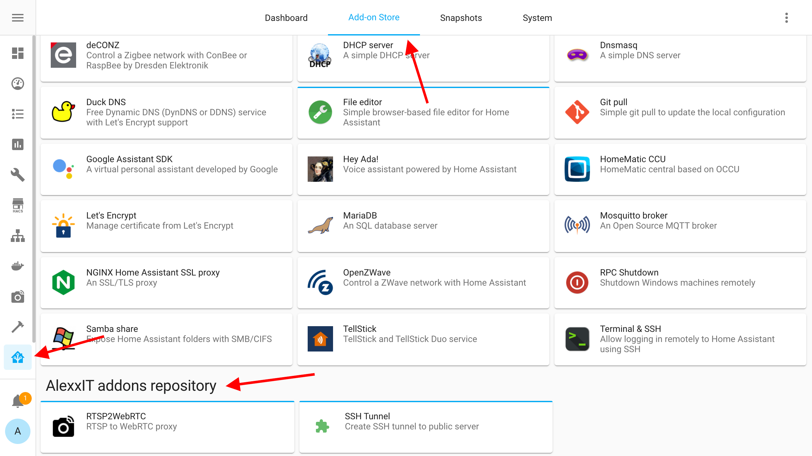
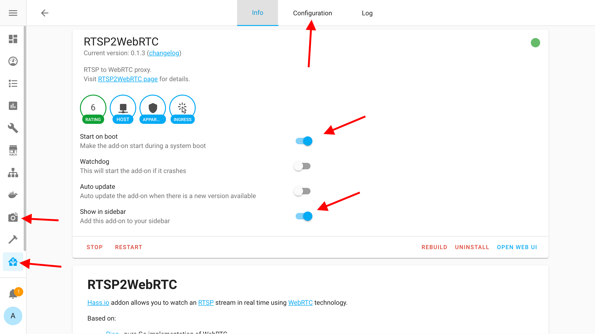

# zhouguangjie hass.io addons

## Install

You must using [Hass.io](https://www.home-assistant.io/hassio/) - supervised [Home Assistant](https://www.home-assistant.io/) version with addon support.

**Add addon repository**

**Manual add addon repository**

`https://github.com/zhouguangjie/hass_addons`

**Install addon**

**Config addon**

